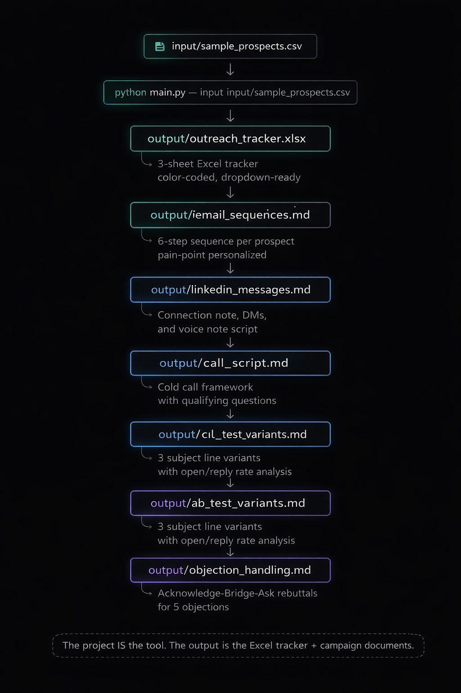
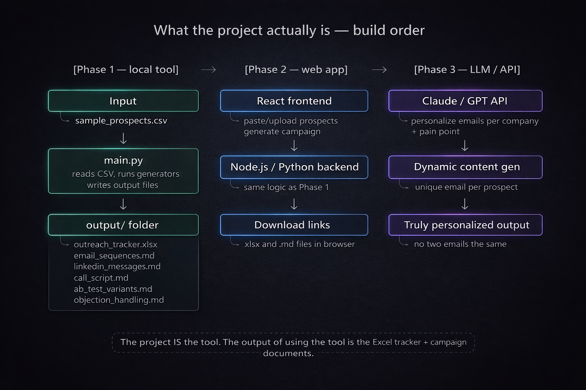

<div align="center">


<br/>

[](https://git.io/typing-svg)

<br/>

[](https://www.python.org/)
[](https://openpyxl.readthedocs.io/)
[]()
[]()

<br/>

[]()
[]()
[]()
[]()
[]()

</div>

---

## 📋 Table of Contents

- [What This Tool Does](#what-this-tool-does)
- [Tech Stack](#tech-stack)
- [Project Structure](#project-structure)
- [Setup and Running](#setup-and-running)
- [Input CSV Reference](#input-csv-reference)
- [How Priority Scoring Works](#how-priority-scoring-works)
- [Pain Point Mapping by Cloud Stack](#pain-point-mapping-by-cloud-stack)
- [Output Files Reference](#output-files-reference)
- [Excel Tracker — Sheet Breakdown](#excel-tracker--sheet-breakdown)
- [Campaign Content — What Gets Generated](#campaign-content--what-gets-generated)
- [CLI Flags](#cli-flags)
- [Sample Terminal Output](#sample-terminal-output)
- [Assumptions and Design Decisions](#assumptions-and-design-decisions)
- [Roadmap](#roadmap)

---

<a name="what-this-tool-does"></a>
## 🎯 What This Tool Does

<div align="center">



</div>

<br/>

This is a **local command-line SDR automation tool** built for cloud cost optimization outreach. You feed it a CSV of prospects — with their name, title, company, cloud stack, and estimated spend — and it generates a complete, personalized outreach campaign in seconds.

No manual copy-pasting. No generic templates. Every output file is populated with the prospect's actual data.

---

<a name="tech-stack"></a>
## 🛠️ Tech Stack

<div align="center">

<table>
  <tr>
    <td align="center" width="120">
      <a href="https://www.python.org/">
        
        <br/><sub><b>Python 3.10+</b></sub>
      </a>
    </td>
    <td align="center" width="120">
      <a href="https://openpyxl.readthedocs.io/">
        
        <br/><sub><b>openpyxl</b></sub>
      </a>
    </td>
    <td align="center" width="120">
      <a href="https://docs.python.org/3/library/csv.html">
        
        <br/><sub><b>csv (stdlib)</b></sub>
      </a>
    </td>
    <td align="center" width="120">
      <a href="https://docs.python.org/3/library/argparse.html">
        
        <br/><sub><b>argparse</b></sub>
      </a>
    </td>
    <td align="center" width="120">
      <a href="https://docs.python.org/3/library/pathlib.html">
        
        <br/><sub><b>pathlib</b></sub>
      </a>
    </td>
    <td align="center" width="120">
      <a href="https://github.com/">
        
        <br/><sub><b>GitHub</b></sub>
      </a>
    </td>
  </tr>
</table>

</div>

<br/>

| | Component | Technology | Purpose |
|---|---|---|---|
| 🐍 | Language | Python 3.10+ | Core runtime — zero external dependencies beyond openpyxl |
| 📊 | Excel Generation | openpyxl 3.1+ | Creates all three tracker sheets with formatting, formulas, and dropdown validation |
| 📄 | CSV Parsing | stdlib `csv` | Reads prospect input — no pandas required |
| ⚙️ | CLI | stdlib `argparse` | `--input`, `--output`, `--verbose` flags |
| 📁 | File I/O | stdlib `pathlib` | Cross-platform path handling throughout |
| 📝 | Content Output | Python f-strings | Template-driven Markdown generation, fully personalized |

> **One external dependency only.** `openpyxl` is the sole pip package. Everything else is Python standard library.

---

<a name="project-structure"></a>
## 📁 Project Structure

```
cold-outreach-tool/
│
├── main.py                        # CLI entry point — argparse, CSV validation, priority scoring
│
├── config/
│   └── icp_config.py              # ICP constants: industries, personas, pain points, priority rules
│
├── generators/
│   ├── __init__.py
│   ├── excel_generator.py         # Builds outreach_tracker.xlsx with 3 sheets
│   └── content_generator.py       # Orchestrates all Markdown file generation
│
├── templates/
│   ├── __init__.py
│   ├── email_sequences.py         # 6-step sequence builder + A/B variant generator
│   ├── linkedin_messages.py       # Connection note, DMs, and voice note script
│   ├── call_script.py             # Cold call framework with voicemail
│   └── objection_handling.py      # 5 Acknowledge-Bridge-Ask rebuttals
│
├── input/
│   └── sample_prospects.csv       # Test input — 10 leads across all cloud stacks
│
├── output/
│   └── .gitkeep                   # Folder tracked; generated files excluded via .gitignore
│
├── requirements.txt               # openpyxl>=3.1.0
├── .gitignore
└── README.md
```

---

<a name="setup-and-running"></a>
## ⚙️ Setup and Running

### Prerequisites
- Python 3.10 or higher
- pip

### Installation

**1. Clone the repository**
```bash
git clone <repository_url>
cd cold-outreach-tool
```

**2. Create and activate a virtual environment**

<details>
<summary>🪟 Windows</summary>

```cmd
python -m venv venv
venv\Scripts\Activate
```
</details>

<details>
<summary>🍎 macOS / 🐧 Linux</summary>

```bash
python3 -m venv venv
source venv/bin/activate
```
</details>

**3. Install dependencies**
```bash
pip install -r requirements.txt
```

**4. Run the tool**
```bash
python main.py --input input/sample_prospects.csv
```

**5. View your output**

All generated files will appear in the `output/` folder. Open `outreach_tracker.xlsx` in Excel or Google Sheets, and the Markdown files in any text editor or VS Code.

---

<a name="input-csv-reference"></a>
## 📥 Input CSV Reference

Place your prospect CSV in `input/` and pass it to `--input`. The tool validates column names before processing — missing required columns will print a clear error and exit.

### Required Columns

| Column | Type | Example | Description |
|---|---|---|---|
| `name` | string | `Arjun Mehta` | Prospect's full name — first name extracted automatically |
| `title` | string | `CTO` | Job title — used for priority scoring and call script |
| `company` | string | `Stackify Labs` | Company name — used throughout all content |
| `industry` | string | `SaaS` | Industry vertical — used for social proof in email Step 3 |
| `company_size` | string | `Mid (51-200)` | Company size bracket |
| `cloud_stack` | string | `AWS` | AWS, GCP, Azure, or Multi-Cloud — drives pain point assignment |
| `estimated_monthly_spend` | number | `52000` | Monthly cloud spend in USD — used for priority scoring |
| `lead_source` | string | `LinkedIn` | LinkedIn, Referral, or Inbound — tracked in Excel |

### Optional Columns

| Column | Behaviour if missing |
|---|---|
| `pain_point` | Auto-assigned from `icp_config.PAIN_POINTS[cloud_stack][0]` |
| `priority_tier` | Auto-calculated using title + spend rules |

### Sample Row

```csv
name,title,company,industry,company_size,cloud_stack,estimated_monthly_spend,lead_source
Arjun Mehta,CTO,Stackify Labs,SaaS,Mid (51-200),AWS,52000,LinkedIn
```

---

<a name="how-priority-scoring-works"></a>
## 🎯 How Priority Scoring Works

Priority is automatically assigned per prospect based on two factors: **job title** and **estimated monthly cloud spend**.

| Tier | Qualifying Titles | Minimum Spend |
|---|---|---|
| 🔴 High | CTO, VP of Engineering, Head of DevOps, Cloud Architect | $40,000/month |
| 🟡 Medium | FinOps Manager, Engineering Manager, Director of Infrastructure | $15,000/month |
| 🟢 Low | Any title or spend below Medium thresholds | — |

> Both conditions must be met for High and Medium. A CTO spending $12,000/month scores Low. A FinOps Manager spending $60,000/month scores Medium, not High.

Priority tier flows through to the Excel tracker's color-coded `Priority_Tier` column, the `campaign_summary.md` high-priority target list, and the `Pain Point Mapping` sheet.

---

<a name="pain-point-mapping-by-cloud-stack"></a>
## ☁️ Pain Point Mapping by Cloud Stack

Each prospect is automatically matched to their cloud stack's most common cost pain point. This is used in the Day 1 cold email body and the Excel Pain Point Mapping sheet.

<details>
<summary><b>☁️ AWS</b></summary>

| Priority | Pain Point |
|---|---|
| Primary | Unoptimized EC2 Reserved Instance coverage |
| Secondary | Unused Elastic IPs and NAT Gateway charges |
| Tertiary | S3 storage class mismatches driving up costs |

</details>

<details>
<summary><b>🔵 GCP</b></summary>

| Priority | Pain Point |
|---|---|
| Primary | Lack of Committed Use Discount utilization |
| Secondary | Idle GKE node pools running 24/7 |
| Tertiary | BigQuery on-demand pricing vs flat-rate analysis |

</details>

<details>
<summary><b>🔷 Azure</b></summary>

| Priority | Pain Point |
|---|---|
| Primary | Azure Hybrid Benefit not applied to VMs |
| Secondary | Orphaned managed disks accumulating costs |
| Tertiary | Dev/test environments not using spot pricing |

</details>

<details>
<summary><b>🌐 Multi-Cloud</b></summary>

| Priority | Pain Point |
|---|---|
| Primary | No unified visibility across cloud spend |
| Secondary | Duplicate services running across AWS and Azure |
| Tertiary | FinOps practice absent — no cloud tagging strategy |

</details>

---

<a name="output-files-reference"></a>
## 📤 Output Files Reference

All output files are written to the `output/` directory on every run. Existing files are overwritten.

| File | Type | Personalized? | Description |
|---|---|---|---|
| `outreach_tracker.xlsx` | Excel | Per prospect | 3-sheet tracker with all prospect data, color coding, and dropdown validation |
| `email_sequences.md` | Markdown | Per prospect | Full 6-step sequence for every prospect in the input CSV |
| `linkedin_messages.md` | Markdown | First prospect (template) | Connection note, 2 DMs, and voice note script |
| `call_script.md` | Markdown | First prospect (template) | 7-section cold call framework |
| `ab_test_variants.md` | Markdown | First prospect (template) | 3 subject line variants with open/reply analysis table |
| `objection_handling.md` | Markdown | Generic | 5 Acknowledge-Bridge-Ask rebuttals |
| `campaign_summary.md` | Markdown | Aggregated | Pipeline counts, cloud/industry breakdown, high-priority list |

> **Template files** (LinkedIn, call script, A/B) use the first prospect as a worked example with a note at the top: *"Customize [First Name] and [Company] for each prospect."*

---

<a name="excel-tracker--sheet-breakdown"></a>
## 📊 Excel Tracker — Sheet Breakdown

### Sheet 1: Outreach Tracker

The main working sheet. All 18 columns with live dropdown validation and conditional formatting.

| Column | Type | Auto-filled Default | Notes |
|---|---|---|---|
| `Lead_ID` | string | `L001`, `L002`... | Sequential, assigned at runtime |
| `Name` | string | from CSV | — |
| `Title` | string | from CSV | — |
| `Company` | string | from CSV | — |
| `Industry` | string | from CSV | — |
| `Company_Size` | string | from CSV | — |
| `Cloud_Stack` | string | from CSV | — |
| `Est_Monthly_Spend` | number | from CSV | — |
| `Lead_Source` | string | from CSV | — |
| `Pain_Point` | string | auto-assigned | From `icp_config.PAIN_POINTS` |
| `Email_Step` | integer | `0` | Update as you progress the sequence |
| `LinkedIn_Step` | string | `Not sent` | Update manually |
| `Call_Attempted` | boolean | `FALSE` | — |
| `Status` | string | `Cold` | Dropdown: Cold / Contacted / Follow-Up / Demo Booked / No Response / Disqualified |
| `Priority_Tier` | string | auto-scored | Dropdown: High / Medium / Low |
| `Next_Action_Date` | date | today + 1 | Update as you work the lead |
| `Response_Notes` | string | empty | Free-text field |
| `Demo_Booked` | boolean | `FALSE` | Flip to TRUE when demo is confirmed |

**Conditional formatting applied:**

| Column | Condition | Fill | Font |
|---|---|---|---|
| `Priority_Tier` | High | `#FFB3B3` | `#8B0000` dark red |
| `Priority_Tier` | Medium | `#FFF2B3` | `#7B6000` dark amber |
| `Priority_Tier` | Low | `#B3FFB3` | `#1B5E20` dark green |
| `Status` | Contacted | `#DDEEFF` | default |
| `Status` | Follow-Up | `#FFE8CC` | default |
| `Status` | Demo Booked | `#CCFFCC` | bold |
| `Status` | No Response | `#EEEEEE` | default |

---

### Sheet 2: Pain Point Mapping

Maps every prospect to their specific cloud pain point and outreach angle. Used to inform personalization before sending.

| Column | Description |
|---|---|
| `Lead_ID` | Links back to Sheet 1 |
| `Name` | Prospect name |
| `Title` | Job title |
| `Company` | Company |
| `Cloud_Stack` | AWS / GCP / Azure / Multi-Cloud |
| `Est_Monthly_Spend` | Monthly cloud spend |
| `Primary_Pain_Point` | Most common pain point for their stack |
| `Secondary_Pain_Point` | Backup angle if primary doesn't land |
| `Mapped_Value_Prop` | 1-sentence CloudKeeper value statement for this pain |
| `Outreach_Angle` | Cost Savings / Visibility / Compliance |

---

### Sheet 3: Performance Analysis

Auto-calculated summary pulling live data from Sheet 1 using Excel cross-sheet formulas.

| Section | Contents |
|---|---|
| A — Pipeline Summary | Total prospects, status breakdown with counts and percentages |
| B — Source Analysis | Leads by source (LinkedIn / Referral / Inbound) with percentages |
| C — Industry and Stack | Count by industry, count by cloud stack |
| D — Simulated Funnel | Contacted (auto), Replies (manual), Demos Booked (auto), Overall Conversion (formula) |

---

<a name="campaign-content--what-gets-generated"></a>
## ✉️ Campaign Content — What Gets Generated

### 6-Step Email Sequence

Each prospect gets a fully personalized sequence substituting their `first_name`, `company`, `cloud_stack`, `pain_point`, and `industry`.

| Step | Day | Type | Angle |
|---|---|---|---|
| 1 | Day 1 | Cold Email | Personalized hook + specific pain point + soft CTA |
| 2 | Day 3 | Follow-Up 1 | Value add — 28–35% cloud waste stat + free audit offer |
| 3 | Day 6 | Follow-Up 2 | Social proof — similar company in their industry cut costs 31% |
| 4 | Day 9 | Follow-Up 3 | FinOps angle — CFO asking questions about the cloud bill |
| 5 | Day 12 | Breakup Email | Professional close — leave door open, no pressure |
| 6 | Day 30 | Re-engagement | Fresh subject — has the situation changed? |

---

### LinkedIn Sequence

| Message | Trigger | Detail |
|---|---|---|
| Connection Request | Day 1 | Under 280 characters, mentions their role + cloud angle |
| DM 1 — Value First | Post-connect | 3–4 sentences, no pitch, offers a resource |
| DM 2 — Bump | Day 6 | References email thread, 2 sentences, low pressure |
| Voice Note Script | Day 6 | Written script with `[pause]` markers — record as 30-second audio |

---

### A/B Subject Line Variants

Three variants for the Day 1 cold email, each targeting a different psychological trigger:

| Variant | Trigger | Simulated Open Rate | Simulated Reply Rate |
|---|---|---|---|
| A — Curiosity | `"Something unusual about [Company]'s cloud bill..."` | 27% | 8% |
| B — Pain-point direct | `"Is your [Cloud Stack] spend growing faster than your team?"` | 32% | 6% |
| C — Social proof | `"How a similar [Industry] company cut cloud costs 31% in 90 days"` | 24% | 4% |

> **Winning hypothesis:** Variant A is recommended for the initial send — despite Variant B's higher open rate, Variant A generates the highest reply rate, meaning more actual conversations per 100 emails sent.

---

### Objection Handling

Five full Acknowledge-Bridge-Ask rebuttals covering:

1. *"We already use native AWS Cost Explorer / GCP Billing tools"*
2. *"We don't have the budget right now"*
3. *"We're too small for this"*
4. *"Send me an email"* (brush-off on a live call)
5. *"We already work with a competitor / another FinOps tool"*

---

<a name="cli-flags"></a>
## ⚙️ CLI Flags

```bash
python main.py --input <path> [--output <dir>] [--verbose]
```

| Flag | Required | Default | Description |
|---|---|---|---|
| `--input` | ✅ Yes | — | Path to the input CSV file |
| `--output` | No | `output/` | Directory where generated files are saved |
| `--verbose` | No | off | Prints each prospect's name, company, priority tier, and assigned pain point after the summary |

---

<a name="sample-terminal-output"></a>
## 🖥️ Sample Terminal Output

```
(venv) python main.py --input input/sample_prospects.csv --verbose

============================================
Cold Outreach Campaign Generator — Complete
============================================
Prospects loaded     : 10
High priority        : 4
Medium priority      : 3
Low priority         : 3

Output files created:
  output/outreach_tracker.xlsx
  output/email_sequences.md
  output/linkedin_messages.md
  output/call_script.md
  output/ab_test_variants.md
  output/objection_handling.md
  output/campaign_summary.md
============================================

- Arjun Mehta (Stackify Labs)        | Tier: High   | Pain Point: Unoptimized EC2 Reserved Instance coverage
- Priya Sharma (FinFlow Technologies) | Tier: High   | Pain Point: Unoptimized EC2 Reserved Instance coverage
- David Kim (LearnSphere)             | Tier: Medium | Pain Point: Lack of Committed Use Discount utilization
- Sarah O'Brien (CartCore)            | Tier: High   | Pain Point: Unoptimized EC2 Reserved Instance coverage
- Rohan Kapoor (MedSync)              | Tier: Medium | Pain Point: Azure Hybrid Benefit not applied to VMs
- Nitesh Joshi (DataPulse)            | Tier: High   | Pain Point: Lack of Committed Use Discount utilization
- Aisha Bello (PayRoute)              | Tier: High   | Pain Point: No unified visibility across cloud spend
- James Turner (ShipEasy)             | Tier: Medium | Pain Point: Unoptimized EC2 Reserved Instance coverage
- Meera Iyer (EduTrack)               | Tier: Low    | Pain Point: Azure Hybrid Benefit not applied to VMs
- Siddharth Rao (NovaBuild)           | Tier: Low    | Pain Point: Unoptimized EC2 Reserved Instance coverage
```

---

<a name="assumptions-and-design-decisions"></a>
## 📌 Assumptions and Design Decisions

<details>
<summary><b>📄 1. stdlib csv over pandas</b></summary>
<br/>

**Chosen for:** Zero extra dependencies. The tool's only pip install is `openpyxl`. Using `csv.DictReader` keeps the install footprint minimal and the tool runnable in any clean Python environment.

**Tradeoff:** No vectorized operations or type inference. Spend values are read as strings and converted with `float()` manually. For a 10–500 row prospect file, performance is identical.

**To migrate:** Swapping `csv.DictReader` for `pandas.read_csv()` in `main.py` is a 5-line change. The rest of the pipeline accepts plain dicts and requires no modification.

</details>

<details>
<summary><b>📝 2. f-string templates over a template engine</b></summary>
<br/>

**Chosen for:** Simplicity and zero overhead. Every content template is a Python function returning an f-string. No Jinja2, no Mako, no additional dependency.

**Tradeoff:** Multi-line f-strings are harder to edit than a `.html` or `.j2` template file. When Phase 3 (LLM integration) is implemented, these functions will be replaced by API calls — so over-engineering the template layer now adds unnecessary complexity.

</details>

<details>
<summary><b>🎯 3. Template-based personalization vs LLM-generated copy</b></summary>
<br/>

**Current approach:** Python f-strings substitute prospect data into fixed templates. Every Arjun gets the same email structure; only the cloud stack, pain point, and company name change.

**Phase 3 approach:** The Anthropic Claude API will replace `build_email_sequence()` with a live API call per prospect, generating truly unique copy based on the company's growth stage, industry, and pain point. This is a drop-in replacement — the function signature stays the same, only the body changes.

**Why not Phase 3 now:** Building Phase 1 as a local, dependency-free tool makes it testable, portable, and demo-able without an API key or internet connection.

</details>

<details>
<summary><b>📊 4. Excel output over a web dashboard</b></summary>
<br/>

**Chosen for:** SDRs live in Excel. A spreadsheet with color-coded tiers, dropdown status updates, and cross-sheet formulas is immediately usable without any training or login.

**Phase 2 approach:** A React + Node.js web app will accept the CSV via a file upload form and return the same Excel and Markdown files as browser downloads. The backend Python logic stays identical — it just runs on a server instead of locally.

</details>

<details>
<summary><b>🏗️ 5. Module separation (config / generators / templates)</b></summary>
<br/>

**Chosen for:** Clean upgrade path. `config/icp_config.py` holds all ICP-specific constants — changing the target customer profile means editing one file, not hunting through templates. `templates/` contains content logic, `generators/` handles file I/O. `main.py` only orchestrates.

**Benefit for Phase 2:** The generators can be imported directly by a Flask/FastAPI backend. No refactoring required — just wrap `generate_excel_tracker()` and `generate_all_content()` in an API endpoint.

</details>

---

<a name="roadmap"></a>
## 🗺️ Roadmap

| Phase | Status | Description |
|---|---|---|
| **Phase 1 — Local CLI Tool** | ✅ Complete | Python CLI reads CSV, outputs Excel tracker + Markdown campaign files |
| **Phase 2 — Web App** | 🔜 Planned | React frontend + Node.js/Python backend — upload CSV via browser, download outputs |
| **Phase 3 — LLM Integration** | 🔜 Planned | Anthropic Claude API generates truly personalized email copy per prospect at runtime |

<br/>

<div align="center">



</div>

<br/>

### Phase 3 — LLM swap (one function, same interface)

```python
# Phase 1 — template-driven (current)
def build_email_sequence(prospect: dict) -> str:
    return f"Hi {prospect['first_name']}, I noticed {prospect['company']} has been growing..."

# Phase 3 — LLM-driven (drop-in replacement, same signature)
def build_email_sequence(prospect: dict) -> str:
    response = anthropic_client.messages.create(
        model="claude-sonnet-4-20250514",
        max_tokens=1000,
        messages=[{"role": "user", "content": f"Write a 6-step cold email sequence for {prospect}..."}]
    )
    return response.content[0].text
```


---


<div align="center">

Built with 🐍 Python &nbsp;·&nbsp; 📊 openpyxl &nbsp;·&nbsp; ☁️ CloudKeeper ICP &nbsp;·&nbsp; ⚡ Phase 2 &amp; 3 Coming Soon


</div>